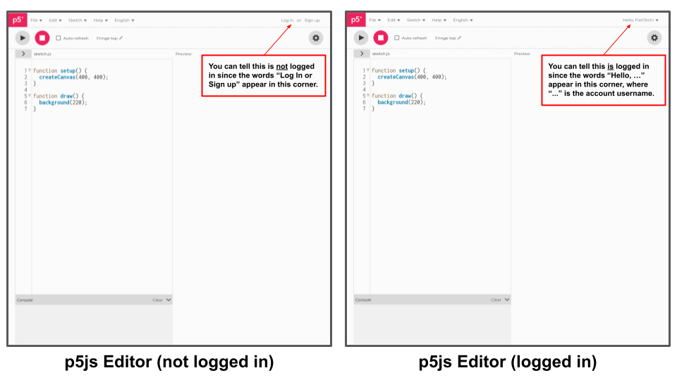

# Video Game Development :: Facility Checklist

**Please reach out with any questions throughout this process. Additionally, if you have any suggestions on how to clarify or improve this documentation, let me know!**

- [ ] Confirm how many interested students you will have at your facility.
- [ ] Confirm your expectations match the [facility requirements](./facility-requirements.md). If there are any concerns, please reach out.
- [ ] Confirm you have enough computer hardware to support each of your students (see the the [computer setup instructions](./computer-setup.md)).
- [ ] Confirm with Andrew how many students you can support (i.e., limited by both your student interest and hardware supply). This is to ensure the class has enough capacity to accomodate all your students adequitly.
- [ ] Ensure your computers are setup by following the [computer setup instructions](./computer-setup.md).
- [ ] "Sanity check" your computer setup by:
    - [ ] Ensuring you can access the Zoom room (link not public, see email) on the computers.
    - [ ] Ensuring you can access the [p5js Editor](https://editor.p5js.org/) in Google Chrome on the computers.
    - [ ] Ensuring each computer has been logged into a p5js account unique to each student (see image below).
- [ ] Send Andrew an email with the following **facility** information:
    1. The full proper name of your facility
    2. Any alternative / shortened names your facility might go by (some facilities have multiple common names, and if I'm not in the know, it can make correspondances confusing!)
    3. Confirm the full name, title, and preferred email address for the facility "educational coordinator" (this is likely you, but I want to make sure I have all your information correct!).
    4. If desired, provide the name and email address for any IT staff you'd like me to correspond with (I will still cc you on any communication). This just saves you from having to be a relay.
- [ ] Send Andrew an email with the following **student** information:
    1. A list of the full names of all participating students from your facility (needed to start the community college accreditation process).
    2. A list of the p5js accounts and login credentials for each participating student (see the [computer setup instructions](./computer-setup.md))

